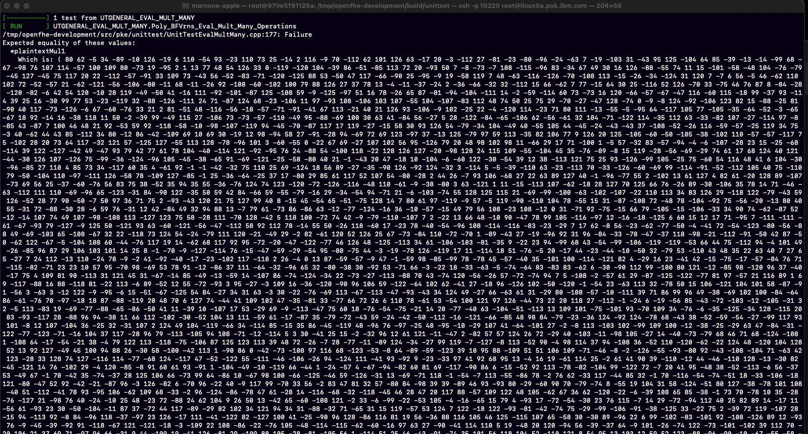

# OpenFHE-S390/x: Enabling Fully Homomorphic Encryption on IBM/S390 Architecture


In this extension, we have incorporated support for the IBM/S390(x) architecture. The predominant concern associated with the S390(x) architecture pertains to its Big-endianness settings, which introduce subtle variations in the behavior of certain built-in C++ functions on this platform. It is important to note that IBM/S390(x) exhibits Big-endianness at both the bit and word levels.

## The (S390/x) issue in the Original Repository

 * Open-FHE compiles with the `-DNATIVE_SIZE=128`; under these 128-bit settings, all the unit tests and examples run, with a few experiencing minor issues.
 * By introducing support for IBM/S390(x) in [`intnat::MultD`](https://github.com/openfheorg/openfhe-development/commit/7a7df9eb215d7dd80df09a069b715b9ac0e96c13), it now allows compilation with the default `NATIVE_SIZE=64`. Consequently, running most of the tests in `unittest/pke` may result in either 'core dumps' or highly inconsistent output. For instance, the following screenshot is generated by calling `./pke_tests --gtest_filter=UTGENERAL_EVAL_MULT_MANY.Poly_BFVrns_Eval_Mult_Many_Operations`.
   
   

## Identifying the Source of the Problem

An important point to note is that `memcpy` can produce different results when copying data in a context where Big/Little Endianness becomes a concern. For instance, when copying from an array of integers, as shown in the following code snippet, the S390(x) `memcpy` version performs the copying in a different order.

```
    __int128 unsigned dest;

    uint64_t vals[2] = {0xaabb, 0xccdd};

    std::memcpy(&dest, vals, 16);
```
In X86_64, GDB displays the copied 128 bits to dst as `0xccdd000000000000aabb`, whereas on S390x, it appears as...

```
(gdb) p/x vals 
$4 = {0xaabb, 0xccdd}
(gdb) p/x dest 
$5 = 0xaabb000000000000ccdd
```

In such contexts, where sensitivity to big/little endianness is a concern, we need to swap the word order in the source. In the example above, we resolved this by modifying to `vals = {0xccdd, 0xaabb};`.

So, that is the logic behind the changes in this Open-FHE extension as we can read, for example, [here](https://github.com/openfheorg/openfhe-development/commit/756888703f7f879f29c92620ad15c825d8b154ef).

## The Final Outcome and Testing

The modifications made to incorporate [`intnat::MultD`](https://github.com/openfheorg/openfhe-development/commit/7a7df9eb215d7dd80df09a069b715b9ac0e96c13) were rigorously tested. This testing included instantiating the corresponding class/object and invoking `intnat::MulD` with random inputs. Additionally, the output was compared between `FIXED_KEY=ON` builds for both X86_64 and IBM/S390x executions.

Overall, the patched version is running consistently on IBM/S390x compared to X86_64, with `NATIVE_SIZE=64` as the build configuration.
