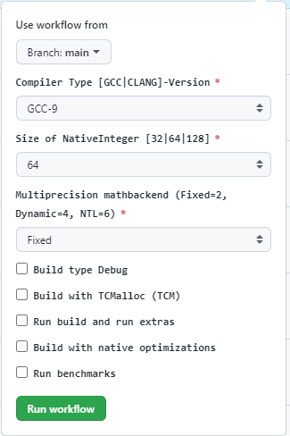

OpenFHE CI/CD Developers Guide
==============================

The `GitHub Documentation <https://docs.github.com/en/actions>`__ is the
best resource for syntax, feature detail, and abilities of the CI/CD.

In order to make modifications to reuseable workflow or actions the
CI/CD changes must be made to the [``github-ci``][5] branch. This branch
is specially protected, and the OpenFHE repository uses references to
the branch for reuseable workflows and actions.

For changes to what happens for the
`Custom <https://github.com/openfheorg/openfhe-development/actions/workflows/custom.yml>`_,
`Main <https://github.com/openfheorg/openfhe-development/actions/workflows/main.yml>`_,
`Manual <https://github.com/openfheorg/openfhe-development/actions/workflows/manual.yml>`_,
or
`Pull-Request <https://github.com/openfheorg/openfhe-development/actions/workflows/pull-request.yml>`_
the files must be updated on the
`main <https://github.com/openfheorg/openfhe-development/tree/main>`_
branch.

::

   ├── .github
   │   ├── actions                       <-- Custom GitHub actions
   │   │   └─ default_builder            <-- Custom GitHub actions to bootstrap the build
   │   │       └── action.yml            <-- Custom action file, defines the steps for a given configuration, cmake -> build -> unittest -> benchmark -> extras
   │   ├── workflows                     <-- GitHub workflows(pipelines)
   │       ├── custom.yml                <-- Runs on-demand a single build of a custom configuration (this can turn all the knobs)
   │       ├── main.yml                  <-- Runs when a branch is merged to main, uses reusable_workflow
   │       ├── manual.yml                <-- Runs on-demand with parameters
   │       ├── pull-request.yml          <-- Runs when a pull-request is created, uses reusable_workflow
   │       └── reusable_workflow.yml     <-- A workflow that handles the default builds and tests the important configurations, uses default_builder/action.yml

Actions
-------

GitHub Actions are used to create function like abilities to the CI/CD.
Thus reducing the scripting, lines of code, and complexity of the
`workflows <#workflows>`__. There is currently a single action to help
build and test a given configuration
`.github/actions/default_builder/action.yml <https://github.com/openfheorg/openfhe-development/blob/main/.github/actions/default_builder/action.yml>`_.

Default Builder
~~~~~~~~~~~~~~~

The default builder handles the setup, build, and running of binaries
(such as unittests and benchmarking) for a single configuration. The
flow of the ``Default Builder`` actions is:

1. Cmake configuration based on *inputs*
2. Build the configuration
3. Run unittests on the configuration
4. If benchmarking is requested via *inputs* run the benchmarks (takes a
   long time)
5. If extras are requested via *inputs* run the extra binaries

The actions are flexible as when can pass ``inputs`` which can be seen
in first section of the
`.github/actions/default_builder/action.yml <https://github.com/openfheorg/openfhe-development/blob/main/.github/actions/default_builder/action.yml>`_.
These inputs can be used throughout the action.yml to change behaviour.

.. note::

   For more info on *GitHub Actions* in general please visit `Learn
   GitHub
   Actions <https://docs.github.com/en/actions/learn-github-actions>`__.
   The remainder of the action description will be specific to our
   implementation and use of GitHub Action features.

Current Action Inputs
~~~~~~~~~~~~~~~~~~~~~

We currently have the following inputs supported:

-  **module_name** - friendly string identifier for the configuration
-  **cmake_args** - fully customizeable string to override all other
   arguments
-  **native_backend** - sets the NATIVE_SIZE
-  **mathbackend** - set the MATHBACKEND
-  **with_debug** - enables the Debug build type
-  **with_tcm** - enables TC malloc
-  **run_extras** - enables the build and executation of extras.
-  **with_nativeopts** - enables native optimizations
-  **run_benchmark** - runs benchmarking

Adding New Inputs
~~~~~~~~~~~~~~~~~

To add a new input to the action it will need to be added to the
``inputs`` section in the
`.github/actions/default_builder/action.yml <https://github.com/openfheorg/openfhe-development/blob/main/.github/actions/default_builder/action.yml>`__.
There is a constraint of 10 inputs, so care needs to be taking when
selecting inputs. Select that the type of the input for your input and
choose a default value that will not alter the previous behavior of the
important `workflows <#workflows>`__ After adding the parameter to
`action.yml <https://github.com/openfheorg/openfhe-development/blob/main/.github/actions/default_builder/action.yml>`__
you must set it using the ``with`` field, shown below, in any workflow
that you want to use the new parameter.

*Defining a new input*

.. code:: yaml

   name: 'Default Builder'

   inputs:
       my_new_input:
           description: "Example of how to add a new input to the action"
           type: string
           default: ''

*Using the input*

.. code:: yaml

   uses: ./.github/actions/default_builder
   with:
       module_name: mb4_tcm
       mathbackend: 4
       with_tcm: true
       run_extras: true
       my_new_input: 'Do something new!'

*Using the input value in the action procedure*

.. code:: yaml

       runs:
           ...
           run: |
               echo "New input has value: ${{inputs.my_new_input}}"

The ``${{}}`` is how the procedure can access the passed in value

Workflows
---------

When designing the `our
workflows <https://github.com/openfheorg/openfhe-development/actions>`__ for
OpenFHE we took the approach of bundling multiple configurations
together. This influenced how the
`action.yml <https://github.com/openfheorg/openfhe-development/blob/main/.github/actions/default_builder/action.yml>`__
was designed, as we want to have the server configure, build, and run
outputs without needing to pass artifacts around. Previously we had done
all the builds for every configuration, then ran all the unittests for
all the configurations, etc. This required over 20GB of artifacts be
passed around. This means that each conifguration must build and pass
all tests before another build can be evaluated.

.. note::
   For more general information on GitHub Workflows please visit `Using
   Workflows <https://docs.github.com/en/actions/using-workflows>`__

There are 5 total Workflows:

- `Custom <#Custom-Workflow>`_ - Used to kick off a single build and test that can turn all the knobs.

- `Main <#Main-Workflow>`_ - Used to extensively test pushes to the main branch and publish docs.

  - This also runs if pushes are made to the `github-ci <https://github.com/openfheorg/openfhe-development/tree/github-ci>`__ branch to allow testing and development of the CI. -

- `Manual <#manual-workflow>`_ - Used to do a batch of builds with a control over compilers, native size, configurations

- `Pull-Request <#pull-request-workflow>`__ - Used to test any pull-requests generated, this tests a healthy number of configurations but is not as extensive as **Main**.

- `Reuseable Workflow <https://github.com/openfheorg/openfhe-development/actions/workflows/reuseable_workflow.yml>`__ - This is not run from the GitHub UI, but instead is used to allow ``pull-request`` and ``main`` workflows to use a large portion of shared code.

Custom Workflow
~~~~~~~~~~~~~~~

The custom workflow allows to select a number of options that are
supported and worth testing on a server. See the diagram below for the
options. All the options are created in the
`.github/workflows/custom.yml <https://github.com/openfheorg/openfhe-development/actions/workflows/custom.yml>`__
file under the ``on.workflow_dispatch.inputs`` property. The ``jobs``
property is short and sweet for this workflow as it is only going to
kickoff a single ``default_builder`` action with the corresponding
option values. This workflow essentially gives the UI direct access to
the ``default_builder``.

.. note:: There is a limit of 10 inputs.

JSON Maps
^^^^^^^^^

There are two important JSON maps in the `Custom
Workflow <#custom-workflow>`__ to map the string input options, as the
key, to a corresponding cmake/action string value to pass onward. The
value for each map pair is corresponds to the lower level requirements,
thus whatever the option is driving is what the map’s value is derived
from. This is why the ``MATHBACKEND`` is a number value and the
``COMPILER`` is a direct cmake argument string. Currently to (and for
simplicity this will likely remain) set the compiler the ``cmake_arg``
override argument is used to set the desired compiler. For more info on
the compiler map visit section `Compiler
Selection <#compiler-selection>`__

.. warning:: Before adding new compiler options developers must ensure that the
   server as the compiler installed and match the path correctly in the
   JSON map.

**example JSON map definition**

.. code:: yaml

   env:
       MATHBACKEND_MAP: >-
           {
               "Fixed"   : "2",
               "Dynamic" : "4",
               "NTL"     : "6"
           }

**Passing json map’s value to custom action**

.. code:: yaml

   jobs:
       default:
       # ...
       - name: default
           uses: openfheorg/openfhe-development/.github/actions/default_builder@github-ci
           with:
               # ...
               mathbackend: ${{ fromJson(env.MATHBACKEND_MAP)[github.event.inputs.mathbackend] }}
               # ...

..

.. warning:: The map’s keys are not linked to the inputs options, this must be
   manually kept in sync.

.. _pull-request-workflow-1:

Pull-Request Workflow
~~~~~~~~~~~~~~~~~~~~~

The
`pull-request.yml <https://github.com/openfheorg/openfhe-development/actions/workflows/pull-request.yml>`__
defines the Pull-Request Workflow. The Pull-Request Workflow is run
whenever under 2 conditions: first when a pull-request is opened and
whenever changes are pushed to that branch will the pull-request is
open. The workflow runs on the branch linked to the pull-request. This
is defined by the following code snippet.

.. code:: yaml

   on:
     pull_request:
       branches:
         - main

The Pull-Request Workflow only runs one job which is the `Reuseable
Workflow <#reuseable-workflow>`__ with all inputs set to ``true``.

**Notable differences** \* Doesn’t publish docs \* Doesn’t do
``NATIVE_SIZE=128`` or clang compiler tests

.. _main-workflow-1:

Main Workflow
~~~~~~~~~~~~~

The
`main.yml <https://github.com/openfheorg/openfhe-development/actions/workflows/main.yml>`__
defines the Main Workflow, which runs when changes are pushed to main.
The Main Workflow is also run when changes are pushed to the branch
`github-ci <https://github.com/openfheorg/openfhe-development/tree/github-ci>`__
but this is for testing and development purposes of new CI/CD features.
This is defined by the code snippet:

.. code:: yaml

   on:
     push:
       branches:
         - main
         - github-ci

The Main Workflow use the `Reuseable Workflow <#reuseable-workflow>`__
for the bulk of the jobs. In addition this workflow has 2 other
important testing jobs are run using the
`default_builder <#default-builder>`__ action to test
``NATIVE_SIZE=128`` (mb2_128) and compilation with clang (mb2_clang).
And lastly this workflow has a job that pushes the doxygen generate
documentation to a specific branch,
`gh-pages <https://github.com/openfheorg/openfhe-development/tree/gh-pages>`__
in the repository, is best access through the
`github-pages <https://bookish-barnacle-cfd572c2.pages.github.io/>`__.

Reuseable Workflow
~~~~~~~~~~~~~~~~~~

The
`reuseable_workflow.yml <https://github.com/openfheorg/openfhe-development/actions/workflows/reuseable_workflow.yml>`__
defines the Reuseable Workflow, which is not run directly through GitHub
pushes, pull-requests, or UI interactions. Instead this workflow
encapuslates the bulk of the CI/CD that should be use in multiple
workflows. This workflow is declared reuseable by the following code
snippet:

.. code:: yaml

   on:
     workflow_call:
       inputs:
           # ...

Where ``workflow_call`` property enables other workflows to run this
entire workflow through the following calling squence:

.. code:: yaml

   jobs:
     call:
       uses: openfheorg/openfhe-development/.github/workflows/reuseable_workflow.yml@github-ci
       with:
           # ...

The Reuseable Workflow makes use of the `Default
Builer <#default-builder>`__ to run configuration checks for a number of
configurations that correspond to the Reuseable Workflow’s ``inputs``.

**Inputs**

- mb2_debug
- mb2_tcm
- mb4_noflag
- mb4_debug
- mb4_tcm
- mb6_ntl_noflag
- mb6_ntl_debug_tcm
- mb6_ntl_tcm

Each of these ``inputs`` is a boolean that enables or disables the
corresponding job. There is one job that is implicitly always enabled,
``default``, which is also mb2_noflag if the same naming convention was
used. The ``default`` job is the portable build and what is created when
no inputs are given to cmake. This allows other workflows to turn off
pieces of the workflow if not desired. This is done by using the inputs
in the following way:

.. code:: yaml

     mb2_tcm:
       needs: [default, mb4_noflag, mb6_ntl_noflag]
       runs-on: [self-hosted, Linux, X64]
       # This is the line that enables/disables the mb2_tcm job!
       # There for everything after this line, for this indented section, is skipped
       if: inputs.mb2_tcm
       steps:
       - name: Checkout Code
         uses: actions/checkout@v2

       - name: mb2_tcm
         uses: openfheorg/openfhe-development/.github/actions/default_builder@github-ci
         with:
           module_name: mb2_tcm
           mathbackend: 2
           with_tcm: true
           run_extras: true

.. _manual-workflow-1:

Manual workflow
~~~~~~~~~~~~~~~

The manual workflow allows for more configurations to be tested and the
flexibility to test unique combinations. Should a new parameter be added
it will need to be added to the ``on.workflow_dispathc.inputs`` section.
Currently we have inputs of type ``options`` which will yield a dropdown
and ``boolean`` which will yield a toggle box. There is a third type
GitHub supports which is a ``string`` that we don’t use on purpose.

Currently the default build is always run, and like the
`main <#main-workflow>`__ and `pull-request <#pull-request>`__ workflows
the other builds depend on it. The difference is that each of the
secondary build configurations can be enabled/disabled. By default none
of the secondary builds are enabled. The code that enabled this is shown
in the `Enablable Build <#enablable-build>`__

.. figure:: ci_cd_assets/manual_workflow_options.png
   :alt: manual_workflow_options

Enablable Build
^^^^^^^^^^^^^^^

The code that allows the individual builds are a combination of the
boolean inputs and an ``if`` in the *jobs*. See the example below for
the **debug_mb2**

*input section*

.. code:: yaml

   debug_mb2:
           description: 'Run debug_mb2'
           type: boolean
           required: true
           default: 'false'

The ``type`` key defines this input to be a checkbox, true or false, and
the ``default`` unchecks/disables this by default. This key itself,
``debug_mb2``, will be what is used later to enable/disable the job to
run.

*job section*

.. code:: yaml

   debug_mb2:
       needs: default
       if: ${{ github.event.inputs.debug_mb2 == 'true' }}
       runs-on: [self-hosted, Linux, X64]
       env:

The ``needs`` key, first line in the *debug_mb2* job, is to create a
dependancy on the default, thus this will run after the default
configuration completes. The ``if`` key, second line, is where we
conditionally run the job, this logic uses the input parameter
``debug_mb2`` and skips the rest of this second if it is false.

Compiler Selection
^^^^^^^^^^^^^^^^^^

Selecting the compiler is a bit convoluted, the JSON syntax is used to
create a map between compilers and the cmake options to use the compiler
selected. This map uses the
``workflow_dispatch.inputs.compiler.options`` as the key, and the cmake
equivalent option as the value.

.. note:: This is linked by the definition of **COMPILERS_MAP** in the jobs

   - Modifying the input will require modification of all *env.COMPILERS_MAP*

Because we want to support many compilers and versions we will need to
expose more pairs in the future. For now the key things to understand is
the map and how it’s used.

Below is how we’ve created the map, we use JSON syntax in the yml and do
so on multiple lines with ``>-`` operator.

*Compiler map definition*

.. code:: yaml

   COMPILERS_MAP: >-
   {
       "GCC"   : "-DCMAKE_CXX_COMPILER=/usr/bin/g++-9 -DCMAKE_C_COMPILER=/usr/bin/gcc-9",
       "CLANG" : "-DCMAKE_CXX_COMPILER=/usr/bin/clang++-10 -DCMAKE_C_COMPILER=/usr/bin/clang-10"
   }

Below is a snippet to parse the cmake options from the selected compiler
input

*Compiler map value access by key input*

.. code:: yaml

   cmake_args: ${{ fromJson(env.COMPILERS_MAP)[github.event.inputs.compiler] }}

..

   .. note:: This can’t be done in the `.github/actions/default_builder/action.yml <https://github.com/openfheorg/openfhe-development/blob/main/.github/actions/default_builder/action.yml>`__,
      as access to the ``fromJson`` function isn't available in that scope.

Modifying or Adding New Workflows
~~~~~~~~~~~~~~~~~~~~~~~~~~~~~~~~~

When developing a new workflow it is required that the *Default Branch*
be set to whatever your development branch is to expose the workflows,
and thus reverted on completetion. This can be done by navigating to the
repository’s ``Settings > Branches`` and selecting a new *Default
Branch* as shown below.

.. figure:: ci_cd_assets/switch_default_branch_diagram.png
   :alt: switch_default_branch_diagram

When modifying an existing workflow there are a few approaches for
testing your changes. If the changes are to
`pull-request <#pull-request>`__ as soon as a pull-request is generated.

**Please take care with naming new workflows** - Follow the design
pattern already in use, where the Workflows name and the corresponding
YML file are related via the pattern:

-  YML File: new-workflow.yml

-  Workflow Name:

   .. code:: yaml

      name: New Workflow

Setup GitHub Actions Runner
---------------------------

Setup Linux Server for OpenFHE
~~~~~~~~~~~~~~~~~~~~~~~~~~~~~~

OpenFHE To see how to setup
`linux_platform_packages.sh <https://github.com/openfheorg/openfhe-development/blob/main/scripts/setup/linux_platform_packages.sh>`__
in the repository, or run it on your linux platform.

.. note:: This is for an Ubuntu 20.04 distribution

Launch an EC2 Instance using AWS CLI
~~~~~~~~~~~~~~~~~~~~~~~~~~~~~~~~~~~~

::

   aws ec2 run-instances \
       --image-id <AMI-Id> \
       --count 1 \
       --instance-type <EC2-Type> \
       --key-name <Key-Pair-Name> \
       --subnet-id <Subnet> \
       --security-group-ids <Security-Group-ID>
       --user-data file://user-data.txt

This will create an EC2 instance.

Configure the EC2 Instance as GitHub Actions Runner
~~~~~~~~~~~~~~~~~~~~~~~~~~~~~~~~~~~~~~~~~~~~~~~~~~~

Refer this documentation,
`adding-self-hosted-runners <https://docs.github.com/en/actions/hosting-your-own-runners/adding-self-hosted-runners>`__,
on how to self-hosted runner to a repository. Below is an image of how
to verify that a self-hosted runner is linked to the repository.

.. figure:: ci_cd_assets/github_add_self_hosted_server.png
   :alt: github_add_self_hosted_server

.. raw:: html

   <!-- References -->

.. raw:: html

   <!-- This one should change SOON to openfhe.github.io or similar -->

