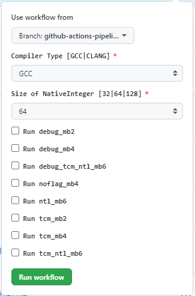

OpenFHE CI/CD Developers Guide
==============================

The `GitHub Documentation <https://docs.github.com/en/actions>`__ is the
best resource for syntax, feature detail, and abilities of the CI/CD.

In order to make modifications to reuseable workflow or actions the
CI/CD changes must be made to the [``github-ci``][5] branch. This branch
is specially protected, and the OpenFHE repository uses references to
the branch for reuseable workflows and actions.
::

   ├── .github
   │   ├── actions                       <-- Custom GitHub actions
   │   │   └─ generic_workflow_builder   <-- Custom GitHub actions to bootstrap the build
   │   │       └── action.yml            <-- Custom action file, defines the steps for a given configuration, cmake -> build -> unittest
   │   ├── workflows                     <-- GitHub workflows(pipelines)
   │       └── generic_workflow.yml      <-- A reuseable workflow that handles the default builds and tests the important configurations, uses generic_workflow_builder/action.yml

For changes to what happens for the
`Main <https://github.com/openfheorg/openfhe-development/actions/workflows/main.yml>`_,
`Manual <https://github.com/openfheorg/openfhe-development/actions/workflows/manual.yml>`_,
or
`Pull-Request <https://github.com/openfheorg/openfhe-development/actions/workflows/pull-request.yml>`_
the files must be updated on the
`main <https://github.com/openfheorg/openfhe-development/tree/main>`_
branch.

::

   ├── .github
   │   ├── workflows                     <-- GitHub workflows(pipelines)
   │       ├── main.yml                  <-- Runs when a branch is merged to main, uses generic_workflow
   │       ├── manual.yml                <-- Runs on-demand with parameters, uses generic_workflow
   │       ├── pull-request.yml          <-- Runs when a pull-request to main is created, uses generic_workflow

Actions
-------

GitHub Actions are used to create function like abilities to the CI/CD.
Thus reducing the scripting, lines of code, and complexity of the
`workflows <#workflows>`__. There is currently a single action to help
build and test a given configuration
`.github/actions/generic_workflow_builder/action.yml <https://github.com/openfheorg/openfhe-development/blob/github-ci/.github/actions/generic_workflow_builder/action.yml>`_.

Generic Workflow Builder
~~~~~~~~~~~~~~~

This builder handles the setup, build, and running of binaries
(such as unittests) for a single configuration. The flow of
the ``Generic Workflow Builder`` actions is:

1. Cmake configuration based on *inputs*
2. Build the configuration
3. Run unittests on the configuration

The actions are flexible as when can pass ``inputs`` which can be seen
in first section of the
`.github/actions/generic_workflow_builder/action.yml <https://github.com/openfheorg/openfhe-development/blob/github-ci/.github/actions/generic_workflow_builder/action.yml>`_.
These inputs can be used throughout the action.yml to change behaviour.

.. note::

   For more info on *GitHub Actions* in general please visit `Learn
   GitHub
   Actions <https://docs.github.com/en/actions/learn-github-actions>`__.
   The remainder of the action description will be specific to our
   implementation and use of GitHub Action features.

Current Action Inputs
~~~~~~~~~~~~~~~~~~~~~

We currently have the following inputs supported:

-  **module_name** - friendly string identifier for the configuration
-  **cmake_args** - string with all arguments set up in the calling workflow

Adding New Inputs
~~~~~~~~~~~~~~~~~

To add a new input to the action it will need to be added to the
``inputs`` section in the
`.github/actions/generic_workflow_builder/action.yml <https://github.com/openfheorg/openfhe-development/blob/github-ci/.github/actions/generic_workflow_builder/action.yml>`__.
There is a constraint of 10 inputs, so care needs to be taking when
selecting inputs. Select that the type of the input for your input and
choose a default value that will not alter the previous behavior of the
important `workflows <#workflows>`__ After adding the parameter to
`action.yml <https://github.com/openfheorg/openfhe-development/blob/github-ci/.github/actions/generic_workflow_builder/action.yml>`__
you must set it using the ``with`` field, shown below, in any workflow
that you want to use the new parameter.

*Defining a new input*

.. code:: yaml

   name: 'Generic Workflow Builder'

   inputs:
       my_new_input:
           description: "Example of how to add a new input to the action"
           type: string
           default: ''

*Using the input*

.. code:: yaml

   uses: ./.github/actions/generic_workflow_builder
   with:
       module_name: ${{ github.job }}
       # ...
       my_new_input: 'Do something new!'

*Using the input value in the action procedure*

.. code:: yaml

   runs:
      # ...
      run: |
         echo "New input has value: ${{inputs.my_new_input}}"

The ``${{}}`` is how the procedure can access the passed in value

Workflows
---------

When designing the `workflows <#workflows>`__ for OpenFHE we took the approach
of bundling multiple configurations together. This influenced how the
`action.yml <https://github.com/openfheorg/openfhe-development/blob/github-ci/.github/actions/generic_workflow_builder/action.yml>`__
was designed, as we want to have the server configure, build, and run
outputs without needing to pass artifacts around. Previously we had done
all the builds for every configuration, then ran all the unittests for
all the configurations, etc. This required over 20GB of artifacts be
passed around. This means that each conifguration must build and pass
all tests before another build can be evaluated.

Currently the default build always runs, and the other builds depend on it. Even when the other workflow jobs are off.

.. note::
   For more general information on GitHub Workflows please visit `Using
   Workflows <https://docs.github.com/en/actions/using-workflows>`__

There are 3 custom and one reuseable workflows:

- `Main <#main-workflow>`__ - To extensively test pushes to the main branch and publish docs.

- `Manual <#manual-workflow>`__ - To do a batch of builds with a control over compilers, native size, configurations.

- `Pull-Request <#pull-request-workflow>`__ - To test any pull-requests generated, this tests a healthy number of configurations but is not as extensive as **Main**.

- `Generic/Reuseable Workflow <#generic-reuseable-workflow>`__ - To be called by any custom workflow.

They all allow to select a number of options that are supported and worth testing on a server.
NOTE: ALL the options for Manual must exist in both properties ``on.workflow_call.inputs`` and ``on.workflow_dispatch.inputs``.
It is necessary as Manual calls a reuseable workflow.

As Main and Pull-Request are kicked off automatically and all their input options are hardcoded
in the ``job`` section under the ``with`` property.

.. note:: There is a limit of 10 inputs.

JSON Maps
^^^^^^^^^

There are two important JSON maps used in the workflows:

-  **cmake_args_map** - maps the job name to the job's specific set of cmake arguments (3 custom workflows only)
-  **COMPILERS_MAP** - converts the input Compiler Type to a string with cmake arguments to set the compiler for C and C++ (generic_workflow only)

.. warning:: Before adding a new compiler option developers must ensure that the
   server has the compiler installed and the cmake arguments specifying that compiler's path are correctly set in the JSON map.

**example: passing a JSON map as an input to generic_workflow.yml**

.. code:: yaml

   jobs:
   call:
      uses: openfheorg/openfhe-development/.github/workflows/generic_workflow.yml@github-ci
      with:
         # ...
         # cmake_args_map holds job specific additional cmake options. compiler flags, native_backend flag and
         # OpenMP flag are set in generic_workflow.yml
         cmake_args_map: '{
                     # ...
                     "mb2"               : "-DBUILD_EXTRAS=ON -DMATHBACKEND=2",
                     "mb2_tcm"           : "-DBUILD_EXTRAS=ON -DMATHBACKEND=2 -DWITH_TCM=ON",
                     # ...
                     "mb6_ntl_debug_tcm" : "-DBUILD_EXTRAS=ON -DMATHBACKEND=6 -DWITH_NTL=ON -DWITH_TCM=ON -DCMAKE_BUILD_TYPE=Debug",
                  }'
..
.. warning:: The map’s keys are not linked to the inputs options, this must be manually kept in sync.

.. _pull-request-workflow-1:

Pull-Request Workflow
~~~~~~~~~~~~~~~~~~~~~

The
`pull-request.yml <https://github.com/openfheorg/openfhe-development/actions/workflows/pull-request.yml>`__
defines the Pull-Request Workflow, which runs when a pull request is
opened or reopened or when the head branch of the pull request is updated.
Currently it is setup to run on the main branch only. This is defined by the following code snippet.

.. code:: yaml

   on:
     pull_request:
       branches:
         - main

The Pull-Request Workflow calls `Generic/Reuseable Workflow <#generic-reuseable-workflow>`__ and
runs all jobs with ``NATIVE_SIZE=128`` and ``GCC`` only.

.. _main-workflow-1:

Main Workflow
~~~~~~~~~~~~~

The
`main.yml <https://github.com/openfheorg/openfhe-development/actions/workflows/main.yml>`__
defines the Main Workflow, which runs when changes are pushed to the main branch.

.. code:: yaml

   on:
     push:
       branches:
         - main

The Main Workflow calls `Generic/Reuseable Workflow <#generic-reuseable-workflow>`__ and 
runs all jobs with all native backends and with both GCC and CLANG.
And lastly this workflow has a job that pushes the doxygen generated documentation to a specific branch,
`gh-pages <https://github.com/openfheorg/openfhe-development/tree/gh-pages>`__ in the repository.

.. _manual-workflow-1:

Manual workflow
~~~~~~~~~~~~~~~

The manual workflow allows for more configurations to be tested and the flexibility to test unique combinations of the compiler,
NativeInteger sizes and jobs.

.. _generic-reuseable-workflow-1:

Generic/Reuseable Workflow
~~~~~~~~~~~~~~~~~~

The ``generic_workflow.yml`` defines the reuseable workflow, which is not run directly through GitHub
pushes, pull-requests, or UI interactions. Instead this workflow encapuslates the bulk of the CI/CD that should be used
in multiple workflows. This workflow is declared reuseable by the following code snippet:

.. code:: yaml

   on:
     workflow_call:
       inputs:
           # ...

Where ``workflow_call`` property enables other workflows to run this entire workflow through the following calling squence:

.. code:: yaml

   jobs:
     call:
       uses: openfheorg/openfhe-development/.github/workflows/generic_workflow.yml@github-ci
       with:
           # ...

The workflow makes use of the `Generic Workflow Builder <#generic-workflow-builder>`__ to run a number of configurations that correspond to
the workflow’s ``inputs``.

**Inputs**

- MATHBACKEND2 jobs: mb2, mb2_tcm, mb2_debug, all, none
- MATHBACKEND4 jobs: mb4, mb4_tcm, mb4_debug, all, none
- MATHBACKEND6 jobs: mb6_ntl, mb6_ntl_tcm, mb6_ntl_debug_tcm, all, none

Each of these ``inputs`` enables or disables the corresponding job(s). Just a reminder that one job
``default`` is always implicitly enabled.

Compiler Selection
^^^^^^^^^^^^^^^^^^

Selecting the compiler is a bit convoluted, the JSON syntax is used to create a map between compilers and
the cmake options to use the compiler selected. This map uses the ``workflow_call.inputs.compiler`` as the key in
`.github/workflows/generic_workflow.yml <https://github.com/openfheorg/openfhe-development/blob/github-ci/.github/workflows/generic_workflow.yml>`__.
and the cmake equivalent option as the value.

.. note:: This is linked by the definition of **COMPILERS_MAP** in the jobs

   - Modifying the compiler input will require modification of *env.COMPILERS_MAP*
   - Getting cmake compiler options can’t be done in the `.github/actions/generic_builder/action.yml <https://github.com/openfheorg/openfhe-development/blob/github-ci/.github/actions/generic_builder/action.yml>`__,
      as access to the ``fromJson`` function isn't available in that scope.

Below is a part of the existing map using the  ``>-`` operator for multiple lines:

*Compiler map definition*

.. code:: yaml

   COMPILERS_MAP: >-
   {
       # ...
       "GCC-11"   : "-DCMAKE_CXX_COMPILER=/usr/bin/g++-11 -DCMAKE_C_COMPILER=/usr/bin/gcc-11",
       # ...
       "CLANG-14" : "-DCMAKE_CXX_COMPILER=/usr/bin/clang++-14 -DCMAKE_C_COMPILER=/usr/bin/clang-14"
   }

Modifying or Adding New Workflows
~~~~~~~~~~~~~~~~~~~~~~~~~~~~~~~~~

When developing a new workflow it is required that the *Default Branch* be set to whatever 
your development branch is to expose the workflows, and thus reverted on completion.
This can be done by navigating to the repository’s ``Settings > Branches`` and selecting
a new *Default Branch* as shown below.

.. figure:: ci_cd_assets/switch_default_branch_diagram.png
   :alt: switch_default_branch_diagram

When modifying an existing workflow then you should test the changes on your feature branch.
The feature branch can be picked from the "Use workflow from" drop-down menu for `Manual <#manual-workflow>`__ or
can be hardcoded for testing for `Main <#main-workflow>`__ or `Pull-Request <#pull-request-workflow>`__.

**Please take care with naming new workflows** - Follow the design
pattern already in use, where the Workflows name and the corresponding
YML file are related via the pattern:

-  YML File: new-workflow.yml

-  Workflow Name:

   .. code:: yaml

      name: New Workflow

Setup GitHub Actions Runner
---------------------------

Setup Linux Server for OpenFHE
~~~~~~~~~~~~~~~~~~~~~~~~~~~~~~

OpenFHE To see how to setup
`linux_platform_packages.sh <https://github.com/openfheorg/openfhe-development/blob/main/scripts/setup/linux_platform_packages.sh>`__
in the repository, or run it on your linux platform.

.. note:: This is for an Ubuntu 22.04 distribution

Launch an EC2 Instance using AWS CLI
~~~~~~~~~~~~~~~~~~~~~~~~~~~~~~~~~~~~

::

   aws ec2 run-instances \
       --image-id <AMI-Id> \
       --count 1 \
       --instance-type <EC2-Type> \
       --key-name <Key-Pair-Name> \
       --subnet-id <Subnet> \
       --security-group-ids <Security-Group-ID>
       --user-data file://user-data.txt

This will create an EC2 instance.

Configure the EC2 Instance as GitHub Actions Runner
~~~~~~~~~~~~~~~~~~~~~~~~~~~~~~~~~~~~~~~~~~~~~~~~~~~

Refer this documentation,
`adding-self-hosted-runners <https://docs.github.com/en/actions/hosting-your-own-runners/adding-self-hosted-runners>`__,
on how to self-hosted runner to a repository. Below is an image of how
to verify that a self-hosted runner is linked to the repository.

.. figure:: ci_cd_assets/github_add_self_hosted_server.png
   :alt: github_add_self_hosted_server

.. raw:: html

   <!-- References -->

.. raw:: html

   <!-- This one should change SOON to openfhe.github.io or similar -->

