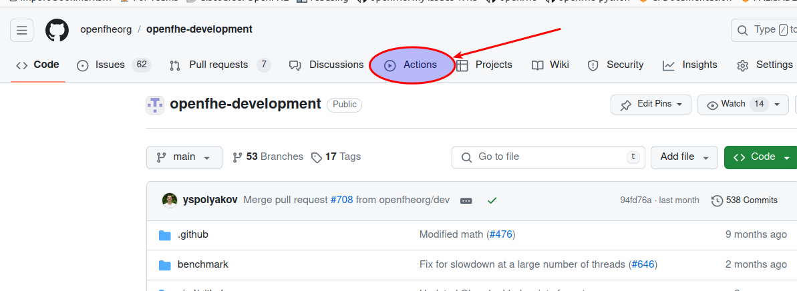
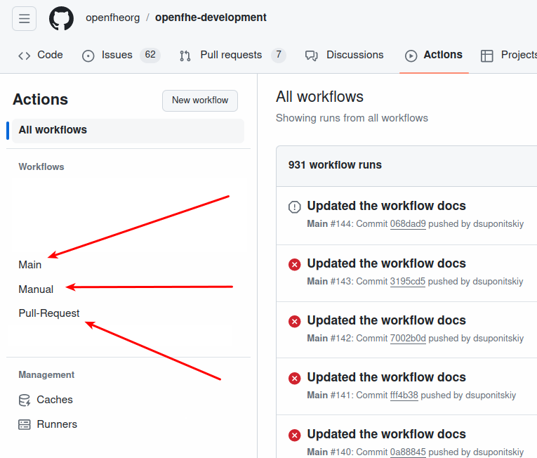
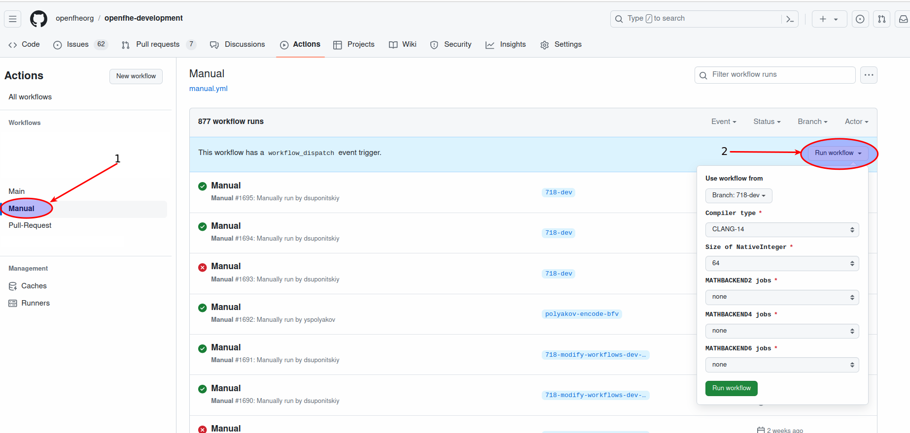

OpenFHE CI/CD Users Guide
=========================

Introduction
------------

This documentation describes OpenFHE workflows on GitHub.

Repository: https://github.com/openfheorg/openfhe-development

::

   ├── .github
   │   ├── workflows                     <-- GitHub workflows(pipelines)
   │       ├── main.yml                  <-- Runs when a branch is merged to main, uses generic_workflow
   │       ├── manual.yml                <-- Runs on-demand with parameters, uses generic_workflow
   │       ├── pull-request.yml          <-- Runs when a pull-request to main is created, uses generic_workflow

OpenFHE Workflows
-----------------

A workflow is a configurable automated process made up of one or more jobs. Workflow files use YAML syntax,
and must have either a .yml or .yaml file extension.

Actions are individual tasks that we can combine to create jobs and customize our workflow. We created a custom action
that wraps up all the common functionality on our jobs.

Features
~~~~~~~~

-  Custom Github Actions (generic_workflow_builder)
-  Workflows are separated into three YAML files (main.yml manual.yml pull-request.yml)
-  Manual pipeline that can be run with custom parameters
-  Build and deploy docs to Github pages only on main branch
-  Jobs can run in parallel
-  The benchmark outputs are exported as artifacts
-  Runs on a self-hosted runners
-  All jobs build unittests, benchmarks and extras
-  All jobs run unittests
-  If the job name includes _tcm, _debug, _ntl, etc., then the job runs with that option (those options)

.. warning: We need to add multiple runners to support concurrent jobs (one self-hosted runner can only run one job at a time)

Pull request Workflow
---------------------

This workflow will run whenever a pull request is created against the main branch. The pull request will run
the default job as well as all build jobs.

The test configurations for all job are shown in the table below:

+-------------------+---------+---------------+-----------+
| Build name        | Backend | NativeInteger | Compiler  |
|                   |         | size(s)       | type(s)   |
+=========+=========+=========+===============+===========+
| default           | Not Set | 64            | GCC       |
+-------------------+---------+---------------+-----------+
| mb2               | 2       | 64            | GCC       |
+-------------------+---------+---------------+-----------+
| mb2_tcm           | 2       | 64            | GCC       |
+-------------------+---------+---------------+-----------+
| mb2_debug         | 2       | 64            | GCC       |
+-------------------+---------+---------------+-----------+
| mb4               | 4       | 64            | GCC       |
+-------------------+---------+---------------+-----------+
| mb4_tcm           | 4       | 64            | GCC       |
+-------------------+---------+---------------+-----------+
| mb4_debug         | 4       | 64            | GCC       |
+-------------------+---------+---------------+-----------+
| mb6_ntl           | 6       | 64            | GCC       |
+-------------------+---------+---------------+-----------+
| mb6_ntl_tcm       | 6       | 64            | GCC       |
+-------------------+---------+---------------+-----------+
| mb6_ntl_debug_tcm | 6       | 64            | GCC       |
+-------------------+---------+---------------+-----------+

Main User Workflow
------------------

The main workflow runs whenever a pull-request is merged to the main branch. The build is very similar to
the pull-request build. It runs more tests and also runs the Pages job which builds and publishes
the doxygen apidocs in GitHub pages.

The test configurations for all job are shown in the table below:

+-------------------+---------+---------------+-----------+
| Build name        | Backend | NativeInteger | Compiler  |
|                   |         | size(s)       | type(s)   |
+=========+=========+=========+===============+===========+
| default           | Not Set | 32/64/128     | GCC/CLANG |
+-------------------+---------+---------------+-----------+
| mb2               | 2       | 32/64/128     | GCC/CLANG |
+-------------------+---------+---------------+-----------+
| mb2_tcm           | 2       | 32/64/128     | GCC/CLANG |
+-------------------+---------+---------------+-----------+
| mb2_debug         | 2       | 32/64/128     | GCC/CLANG |
+-------------------+---------+---------------+-----------+
| mb4               | 4       | 32/64/128     | GCC/CLANG |
+-------------------+---------+---------------+-----------+
| mb4_tcm           | 4       | 32/64/128     | GCC/CLANG |
+-------------------+---------+---------------+-----------+
| mb4_debug         | 4       | 32/64/128     | GCC/CLANG |
+-------------------+---------+---------------+-----------+
| mb6_ntl           | 6       | 32/64/128     | GCC/CLANG |
+-------------------+---------+---------------+-----------+
| mb6_ntl_tcm       | 6       | 32/64/128     | GCC/CLANG |
+-------------------+---------+---------------+-----------+
| mb6_ntl_debug_tcm | 6       | 32/64/128     | GCC/CLANG |
+-------------------+---------+---------------+-----------+

Manual User Workflow
--------------------

The manual pipeline is a workflow that can be run with custom parameters and allows to select jobs to run.
To run manual workflow:

1. Go to the openfhe-development repository at this URL:
   https://github.com/openfheorg/openfhe-development

2. Click on the Actions tab on the center of the upper menu.

3. You will see three Github Workflows on the left side

4. Click on the Run Manually workflow

5. When the Run Manually workflow is selected, you will see a Run
   Workflow button on the right side of the screen. When you click on
   the Run Workflow button, a dialog window with inputs will be opened.

6. Select or check the relevant options and click Run workflow green
   button on the lower section of the dialog
