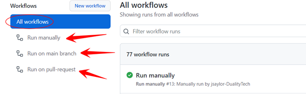
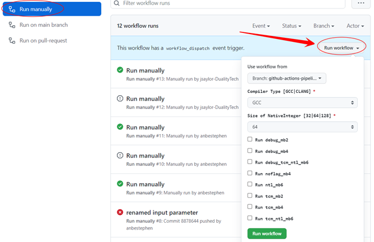

OpenFHE CI/CD Users Guide
=========================

Introduction
------------

This documentation is about the CI/CD Transition from GitLab pipeline to
GitHub Actions workflow. It is also intended to improve our CI/CD
capabilities in the new GitHub environment. Directory structure

Repository: https://github.com/openfheorg/openfhe-development

::

   ├── .github
   │   ├── actions                       <-- Custom GitHub actions
   │   │   └─ default_builder            <-- Custom GitHub actions to bootstrap the build
   │   │       └── action.yml            <-- Custom action file, defines the steps for a given configuration, cmake -> build -> unittest -> benchmark -> extras
   │   ├── workflows                     <-- GitHub workflows(pipelines)
   │       ├── custom.yml                <-- Runs on-demand a single build of a custom configuration (this can turn all the knobs)
   │       ├── main.yml                  <-- Runs when a branch is merged to main, uses reusable_workflow
   │       ├── manual.yml                <-- Runs on-demand with parameters
   │       ├── pull-request.yml          <-- Runs when a pull-request is created, uses reusable_workflow
   │       └── reusable_workflow.yml     <-- A workflow that handles the default builds and tests the important configurations, uses default_builder/action.yml

OpenFHE Workflows
-----------------

A workflow is a configurable automated process made up of one or more
jobs. Workflow files use YAML syntax, and must have either a .yml or
.yaml file extension.

Actions are individual tasks that we can combine to create jobs and
customize our workflow. We created a custom action that wraps up all the
common functionality on our jobs.

Features
~~~~~~~~

-  Custom Github Actions (default-builder)
-  Workflows are separated into three YAML files (main.yml manual.yml
   pull-request.yml)
-  Manual pipeline that can be run with a custom parameters
-  Build and deploy docs to Github pages only on main branch
-  Jobs run in parallel
-  The benchmark outputs are exported as artifacts
-  Runs on a self-hosted runners

.. warning: We need to add multiple runners to support concurrent jobs (one self-hosted runner can only run one job at a time)

Pull request Workflow
---------------------

This workflow will run whenever a pull request is created against the
main branch. The pull request will run the default job as well as all
the build jobs.

The test configurations for each job are shown in the table below

+---------+---------+---------+---------+---------+---------+---------+
| Build   | Build   | Build   | Build   | With    | With    | Backend |
| name    | U       | Be      | Extras  | TCM     | debug   |         |
|         | nitTest | nchmark |         |         |         |         |
+=========+=========+=========+=========+=========+=========+=========+
| default | ON      | OFF     | OFF     | OFF     | OFF     | Not Set |
+---------+---------+---------+---------+---------+---------+---------+
| mb      | ON      | OFF     | ON      | OFF     | ON      | 2       |
| 2_debug |         |         |         |         |         |         |
+---------+---------+---------+---------+---------+---------+---------+
| mb2_tcm | ON      | OFF     | ON      | ON      | OFF     | 2       |
+---------+---------+---------+---------+---------+---------+---------+
| mb4     | ON      | OFF     | ON      | OFF     | OFF     | 4       |
| _noflag |         |         |         |         |         |         |
+---------+---------+---------+---------+---------+---------+---------+
| mb      | ON      | OFF     | ON      | OFF     | ON      | 4       |
| 4_debug |         |         |         |         |         |         |
+---------+---------+---------+---------+---------+---------+---------+
| mb4_tcm | ON      | OFF     | ON      | ON      | OFF     | 4       |
+---------+---------+---------+---------+---------+---------+---------+
| mb6     | ON      | OFF     | ON      | OFF     | OFF     | 6       |
| _noflag |         |         |         |         |         |         |
+---------+---------+---------+---------+---------+---------+---------+
| mb6_de  | ON      | OFF     | ON      | ON      | ON      | 6       |
| bug_tcm |         |         |         |         |         |         |
+---------+---------+---------+---------+---------+---------+---------+
| mb6_tcm | ON      | OFF     | ON      | ON      | OFF     | 6       |
+---------+---------+---------+---------+---------+---------+---------+
| mb2     | ON      | ON      | ON      | ON      | OFF     | 6       |
| _natopt |         |         |         |         |         |         |
+---------+---------+---------+---------+---------+---------+---------+

Main User Workflow
------------------

The main workflow runs whenever a pull-request is merged to the main
branch. The build is similar to the pull-request build, but It also runs
the Pages job which builds and publishes the doxygen apidocs in GitHub
pages.

Manual User Workflow
--------------------

The manual pipeline is a workflow that can be run with custom
parameters. It also allows running specific selected jobs.

Run manual workflow
~~~~~~~~~~~~~~~~~~~

1. Go to the openfhe-development repository at this URL:
   https://github.com/openfheorg/openfhe-development

2. Click on the Actions tab on the center of the upper menu.

.. figure:: ci_cd_assets/run_manual_workflow_step2.png
   :alt: run_manual_workflow_step2

3. You will see three Github Workflows on the left side

4. Click on the Run Manually workflow

5. When the Run Manually workflow is selected, you will see a Run
   Workflow button on the right side of the screen. When you click on
   the Run Workflow button, a dialog window with inputs will be opened.

6. Select or check the relevant options and click Run workflow green
   button on the lower section of the dialog
