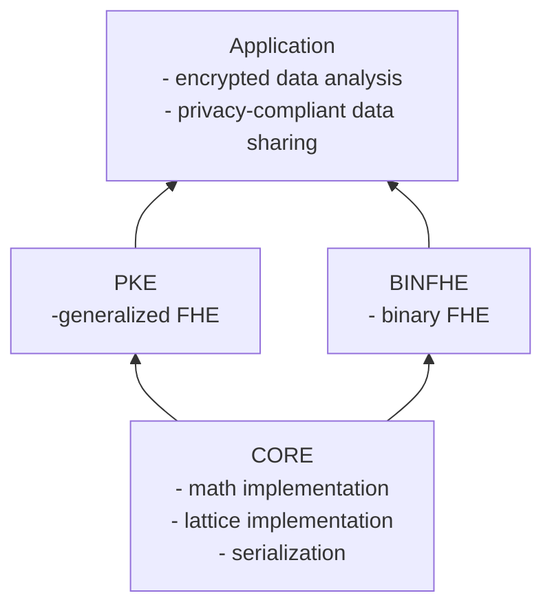

# binFHE

- for binary-FHE applications

# core

- underlying implementation providing the base that `binFHE` and `pke` are built off of

# pke

- for general Homomorphic Encryption applications

## Warning

Although the OpenFHE team have provided various utility functions to make OpenFHE accessible to 
non-cryptographers, it is still necessary for the end-users to carefully consider how they are using the code. Improper use can result in leaked information. 
Use of OpenFHE in production environments should be reviewed by homomorphic encryption experts.