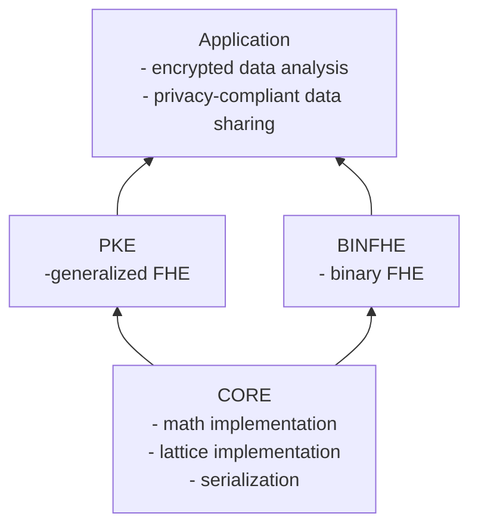

```mermaid
flowchart BT
    A[CORE<br/>- math implementation<br/>- lattice implementation<br/>- serialization] --> B[PKE<br/> -generalized FHE];
    A --> C[BINFHE<br/>- binary FHE];
    B --> D[Application<br/>- encrypted data analysis<br/>- privacy-compliant data sharing];
    C --> D;
```

# binFHE

- for binary-FHE applications

# core

- underlying implementation providing the base that `binFHE` and `pke` are built off of

# pke

- for general Homomorphic Encryption applications
