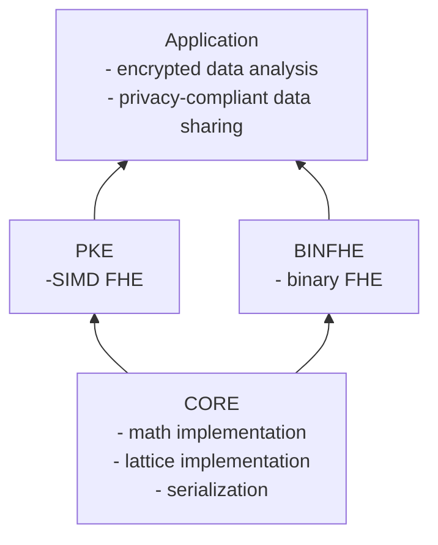

# OpenFHE Code Components

# binFHE

- Boolean arithmetic, comparisons, and aribtrary function evaluation based on DM and CGGI schemes

# core

- underlying implementation providing the base that `binFHE` and `pke` are built off of

# pke

- integer and real-number arithmetic based on BGV, BFV, and CKKS schemes

## Warning

Although the OpenFHE team has provided various utility functions to make OpenFHE accessible to
non-cryptographers, it is still necessary for the end-users to carefully consider how they are using the code. Improper
use can result in leaked information.
Use of OpenFHE in production environments should be reviewed by homomorphic encryption experts.

Additionally, see our [Security Considerations](../docs/static_docs/Security.md) for considerations that should be taken into account
in your work.
