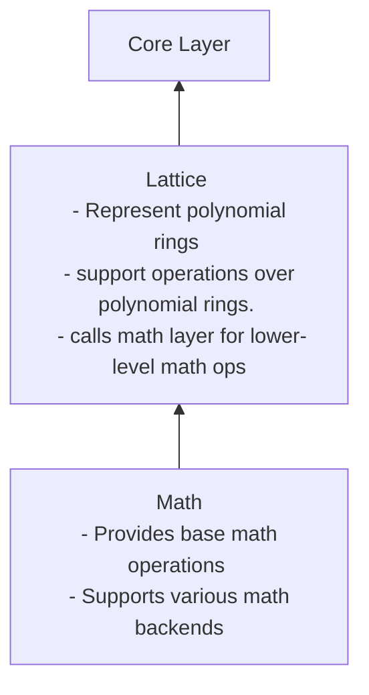

# Core Library Implementation

Contains the underlying primitives that are used in both `pke` and `binfhe`.

## [Lattice](lattice)

- Contains files that support lattice-layer operations in OpenFHE. This layer is used to represent polynomial rings and support operations over those rings. 

- As can be seen above, this is the "middle" layer between higher-level lattice cryptography elements, and the lower level math operations.

## [Math](math)

- TODO

## [Utils](utils)

Contains various utilities across:

- debugging utilities
- memory management utilities
- parallel operations
- serialization
