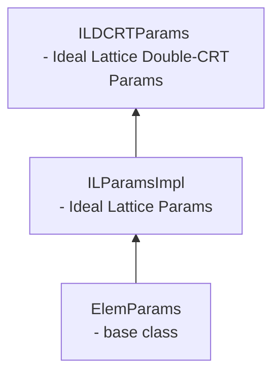
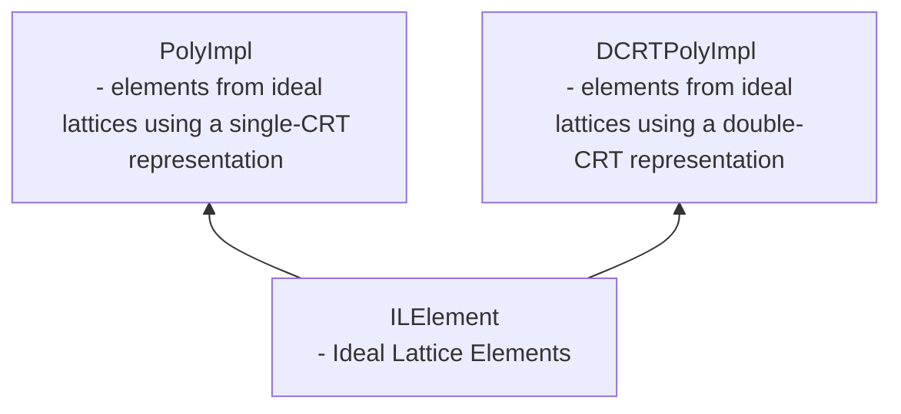

# OpenFHE Lattice Cryptography Library

We provide a brief description of the lattice layer, the various classes of polynomial representations that we support,
and a brief overview of the files present. However, we recommend referring to
our [ReadTheDocs - core/lattice](https://openfhe-development.readthedocs.io/en/latest/assets/sphinx_rsts/modules/core/core_lattice.html)
for more in-depth information.

## The Lattice Layer

- The files in this directory are to support lattice-layer operations in OpenFHE. The layer is used to represent
  polynomial rings and support operations over those polynomial rings.

- This lattice layer is a middle layer in the library. The lattice layer supports higher-level calls for operations on
  ring elements necessary for lattice cryptography. The lattice layer is intended to make calls to lower layers that
  support math operations, such as modulus and ring arithmetic.

## Classes of Polynomials

The three main data classes in this layer are `Poly`, `NativePoly` and `DCRTPoly`.

- A `Poly` is a single-CRT representation using BigInteger types as coefficients, and supporting a large modulus q.

- A `NativePoly` is a single-CRT representation using NativeInteger types, which limites the size of the coefficients and
  the modulus q to 64 bits.

- A `DCRTPoly` is a double-CRT representation. In practice, this means that Poly uses a single large modulus q, while
  DCRTPoly uses multiple smaller moduli. Hence, Poly runs slower than DCRTPoly because DCRTPoly operations can be easier
  to fit into the native bitwidths of commodity processors.

## File Listing
------------

### Parameter Classes

The interactions can be summarized as:

[elemparams.h](elemparams.h):

- a simple class to contain ring element parameters.

[ilparams.h](ilparams.h)

- parameter class for basic single-CRT lattice parameters.
- Inherits from [elemparams.h](elemparams.h)

[ildcrtparams.h](ildcrtparams.h):

- parameter class for double-CRT lattice parameters.
- Inherits from [ilparams.h](ilparams.h)

### Element Classes

[ilelement.h](ilelement.h):

- This file presents a basic interface class for elements from ideal lattices.

[poly.h](poly.h)

- These files present a basic class for `Poly`, elements from ideal lattices using a single-CRT representation.
- This class inherits from the class in [ilelement.h](ilelement.h).
- This file also defines a `NativePoly`, which is simply a `Poly` using `NativeInteger` coefficients. A `NativePoly` is an
  important part of a DCRTPoly.

[dcrtpoly.h](hal/)

- This file presents a basic class for `DCRTPoly`(elements from ideal lattices using a double-CRT representation).
- This class inherits from the class in [ilelement.h](ilelement.h).
- NOTE: this is backend-dependent. To view more information open the `hal` folder.
- NOTE: [lat-hal](lat-hal.h) provides functionality to swap between our different lattice backends.

### Trapdoors

[trapdoor.h](trapdoor.h)

- Provides the utility for sampling trapdoor lattices as described
  in [Implementing Conjunction Obfuscation under Entropic Ring LWE](https://eprint.iacr.org/2017/844.pdf),
  [Building an Efficient Lattice Gadget Toolkit: Subgaussian Sampling and More](https://eprint.iacr.org/2018/946),
  and [Implementing Token-Based Obfuscation under (Ring) LWE](https://eprint.iacr.org/2018/1222.pdf)
- NOTE: Uses [dgsampling](dgsampling.h) to implement the algorithms in the aforementioned papers

[trapdoorparameters.h](trapdoorparameters.h)

- Parameter definitions for trapdoor-related schemes (GPV signature, IBE, ABE)
- Uses [trapdoor.h](trapdoor.h)

### Misc.

[dgsampling.h](dgsampling.h)

- Provides detailed algorithms for G-sampling and perturbation sampling as described
  in [Implementing Conjunction Obfuscation under Entropic Ring LWE](https://eprint.iacr.org/2017/844.pdf),
  [Building an Efficient Lattice Gadget Toolkit: Subgaussian Sampling and More](https://eprint.iacr.org/2018/946),
  and [Implementing Token-Based Obfuscation under (Ring) LWE](https://eprint.iacr.org/2018/1222.pdf)

[field2n.h](field2n.h)

- Represents and defines power-of-2 fields

[stdlatticeparms.h](stdlatticeparms.h)

- Header for the standard values for Lattice Parms, as determined
  by [Homomorphic Encryption Org](homomorphicencryption.org)

- Given (distribution type, security level), we can get a `maxQ` for a given ring dimension, or get a ring dimension given some `maxQ`

## ASSUMPTIONS

* It is assumed that any scalar or vector operation such as multiplication, addition etc. done on one or more operations
  contain the same params.
    - Checks need to be added to the code to test the compatibility of parameters.
* Multiplication is currently only implemented in the EVALUATION format.
    - Code needs to be added to implement COEFFICIENT format multiplication, if desired.
