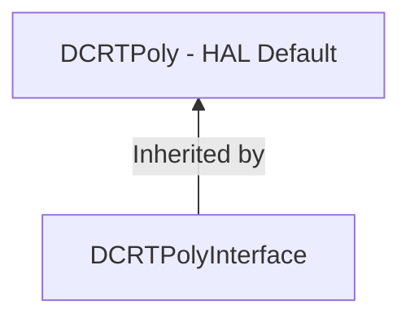

# Hardware Abstraction Layer (HAL)

This hardware abstraction layer allows OpenFHE to use a variety of device backends while still allowing for high performance. As of March 31st 2022, we have the default backend, and the [Intel HEXL](https://github.com/intel/hexl) backend.

## Note:

Follow the convention set by the [hexl](hexl) implementation to extend the supported backends.
