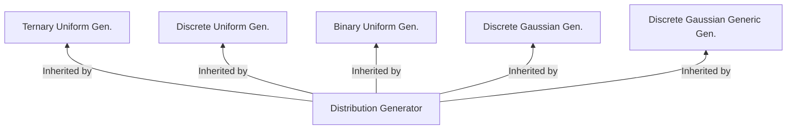

# OpenFHE Core Math

We provide a brief description below, but encourage readers to refer
to [Read The Docs - Core Math](https://openfhe-development.readthedocs.io/en/latest/assets/sphinx_rsts/modules/core/math/core_math.html) for more information about the code.

Additionally, we encourage readers to refer to [Read The Docs - Core Math Backends](https://openfhe-development.readthedocs.io/en/latest/assets/sphinx_rsts/modules/core/math/core_math_backends.html)

# Math Backends

OpenFHE supports a number of mathematical backends for various usecases. For more information refer to [Math Backends](math_backends.md).

# Inheritance Diagram

Let Gen. = Generator

# File Listings

[Binary Uniform Generator](binaryuniformgenerator.h)

- Generate `Uniform` distribution of binary values (mod 2)

[DFT Transform](dftransform.h)

- Discrete Fourier Transform (FFT) code

[Discrete Gaussian Generator](discretegaussiangenerator.h)

- Generate `Gaussian` distribution of discrete values.

[Discrete Gaussian Generator Generic](discretegaussiangeneratorgeneric.h)

- Implements the generic sampler by UCSD discussed in [Gaussian Sampling over the Integers:
  Efficient, Generic, Constant-Time](https://eprint.iacr.org/2017/259.pdf)

[Discrete Uniform Generator](discreteuniformgenerator.h)

- Generate `Uniform` distribution of discrete values.

[Distr Gen](distrgen.h)

- Basic noise generation functionality

[Distribution Generator](distributiongenerator.h)

- Base class for distribution generators

[Hardware Abstraction Layer (HAL)](hal.h)

- Code to switch between math backends

[Matrix](matrix.h)

- Templated matrix implementation for SIMD-compatible matrix code

[Matrix Strassen](matrixstrassen.h)

- Matrix Strassen Operations

[NB Theory](nbtheory.h)

- Number theory utilities
- Check if two numbers are coprime
- GCD of two numbers
- Primality testing
- witness function to test if a number is prime
- Eulers Totient function phin(n)
- Generator Algorithm

[Ternary Uniform Generator](ternaryuniformgenerator.h)

- Provides generation of uniform distribution of binary values
