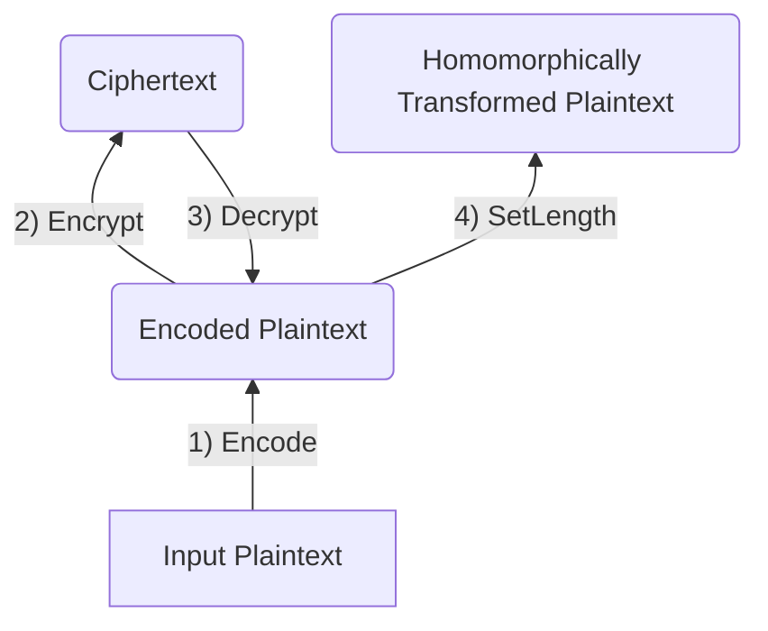

# Encodings

This folder contains the header files of the various encoding formats. Broadly speaking, an encoding is the intermediate transformation between a plaintext and a ciphertext.

We provide a brief overview of the files below. However, we recommend referring to our [ReadTheDocs - PKE/Encoding Headers](https://openfhe-development.readthedocs.io/en/latest/assets/sphinx_rsts/modules/pke/pke_encoding.html) for more in-depth information.

[CKKS Packed Encoding](ckkspackedencoding.h)
- Describes the CKKS packing. Accepts a `std::vector<double>` unlike the other schemes.

[Coef Packed Encoding](coefpackedencoding.h)
- Accepts plaintext data and packs the data into coefficients of a polynomial. 
- Note: is rarely used
- Note: only supports element-wise addition, so ensure that you need this before using

[Encoding Params](encodingparams.h)
- The object containing the parameters for encoding. These parameters are kept and continually reused (can be modified) during the encoding of new values

[Encodings](encodings.h)
- "import" file which can be used for a single `#include`

[Packed Encoding](packedencoding.h)
- Packs integers into a vector
- Note: is almost always what you want to use (other than if you want to deal with floating numbers)

[Plaintext](plaintext.h)
- The base plaintext implementation

[Plaintext Factory](plaintextfactory.h)
- Factory class that instantiates plaintexts

[String Encoding](stringencoding.h)
- Encodes strings