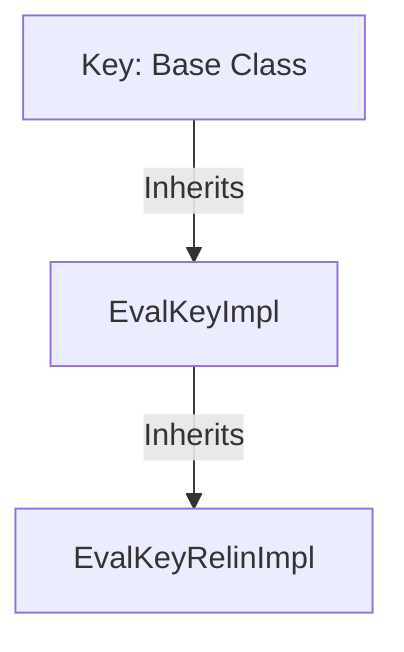
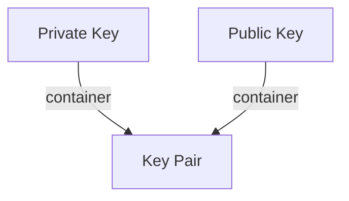

# Keys

This folder contains the header files of the various keys that are defined within `Open-FHE`. Refer to [OpenFHE PKE Keys](https://openfhe-development.readthedocs.io/en/latest/assets/sphinx_rsts/modules/pke/pke_keys.html)

## Key Class Inheritance

## KeyPair

[All Key](allkey.h)
- Top-level `#include` for access to all capabilities

[Eval Key](evalkey.h)
- Inherits from the base [Key](key.h) class. 
- Serves as base class for [Eval Key Relin](evalkeyrelin.h)

[Eval Key Relin](evalkeyrelin.h)
- Get and set relinearization elements
- Get and set key switches for `BinDCRT` and `DCRT` 
- Inherits from [Eval Key](evalkey.h)

[Key](key.h)
- Base Key class

[Key Serialization](key-ser.h)
- Capabilities for serializing the keys using [Cereal](https://github.com/USCiLab/cereal)

[Key Pair](keypair.h)
- Container for the [private key](privatekey.h) and [public key](publickey.h)

[Private Key](privatekey.h)

[Public Key](publickey.h)
