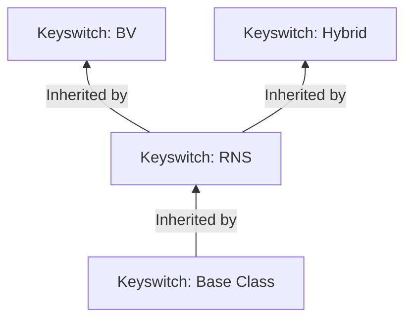

# Key Switching

This folder contains the header files of the various key-switchung capabilities that are defined within `Open-FHE`.
Refer
to [OpenFHE PKE Keys](https://openfhe-development.readthedocs.io/en/latest/assets/sphinx_rsts/modules/pke/pke_keyswitch.html)

## Key Class Inheritance

[Key-switch Base](keyswitch-base.h)
- Base class for Lattice-based cryptography(LBC) Somewhat Homomorphic Encryption(SHE) algorithms.

[Key-switch RNS](keyswitch-rns.h)
- Abstract interface class for RNS LBC SHE algorithms

[Key-switch BV](keyswitch-bv.h)
- Inherits from [key-switch base](keyswitch-base.h)
- Implements

[Key-switch Hybrid](keyswitch-hybrid.h)
- Inherits from [key-switch base](keyswitch-base.h)
- Implements 

