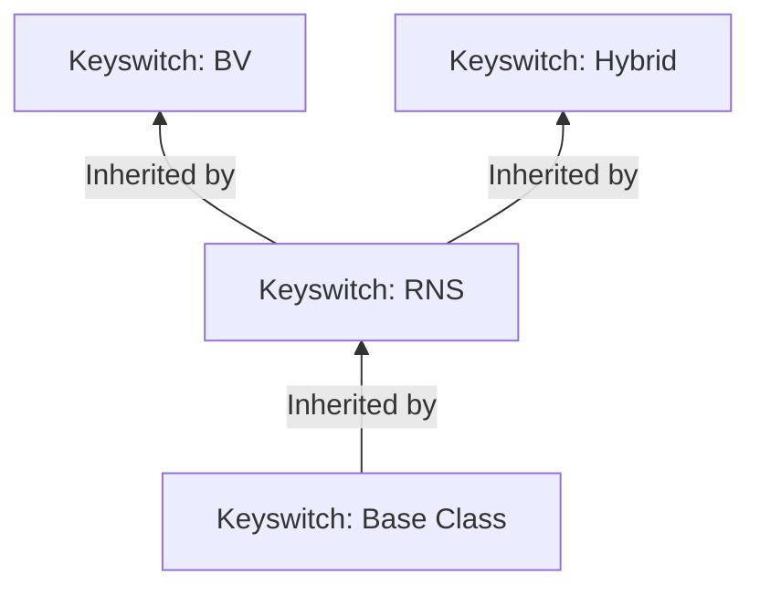

# Key Switching

This folder contains the header files of the various key-switchung capabilities that are defined within `Open-FHE`.
Refer
to [OpenFHE PKE Keys](https://openfhe-development.readthedocs.io/en/latest/assets/sphinx_rsts/modules/pke/pke_keyswitch.html)

The documentation here is based off of [Revisiting Homomorphic Encryption Schemes for Finite Fields](https://eprint.iacr.org/2021/204.pdf)

At a high level, key switching allows transforming a given ciphertext into another ciphertext that can be decrypted with a separate secret key. This is necessary for computing automorphisms and for relinearizing ciphertexts.

## Key Class Inheritance

[Key-switch Base](keyswitch-base.h)

- Base class for Lattice-based cryptography(LBC) algorithms.

[Key-switch RNS](keyswitch-rns.h)

- Abstract interface class for RNS LBC algorithms

[Key-switch BV](keyswitch-bv.h)

- Inherits from [key-switch base](keyswitch-base.h)
- Implements BV scheme from [Fully Homomorphic Encryption from Ring-LWE and Security for Key Dependent Messages (BV Scheme)](https://www.wisdom.weizmann.ac.il/~zvikab/localpapers/IdealHom.pdf)

[Key-switch Hybrid](keyswitch-hybrid.h)

- Inherits from [key-switch base](keyswitch-base.h)
- Uses a mix of the GHS key-switching with the BV key-switching to produce more efficient key-switching. 
- Was introduced in [Homomorphic Evaluation of the AES Circuit(GHS Scheme)](https://eprint.iacr.org/2012/099.pdf)
